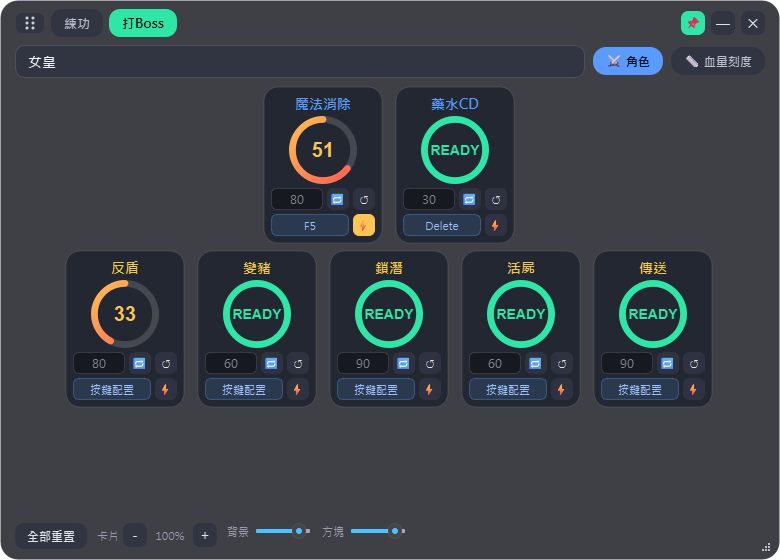
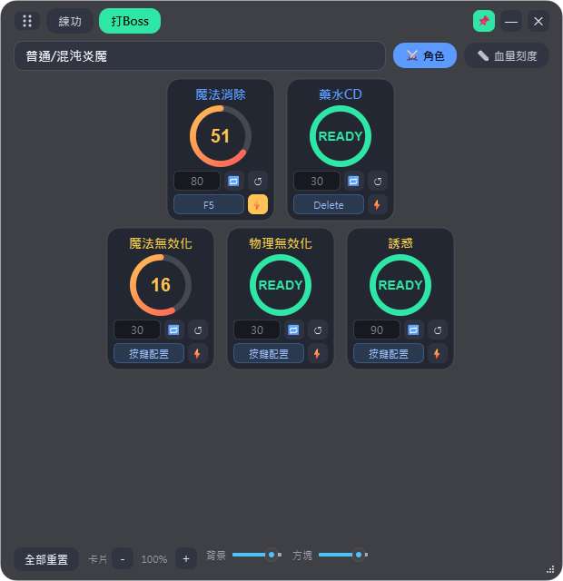
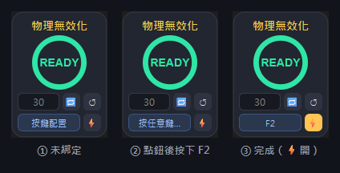
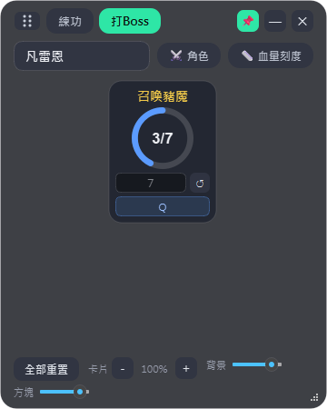
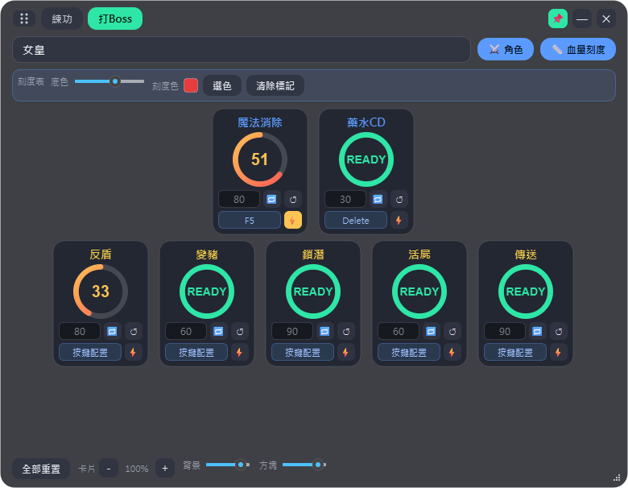

# 楓星小工具

 

一個輔助遊玩 **Maplestory World 楓星** 而設計的輕量桌面小工具，把打 Boss 常用的**技能冷卻計時**、**Boss 血量刻度表**與**練功經驗計算**整合在一個可透明、可置頂、可自由縮放的浮動視窗裡，方便疊在遊戲畫面上使用。

以 Python + PySide6 開發。目前版本 **v1.3.0.0**。

---

## 1. 下載與啟動

此至此處下載 MapleStarTool.exe
https://github.com/hozircon/MapleStarTool/releases/tag/V1.3.0.0

> 若你想從原始碼執行，請參考 [3. 開發相關](#3-開發相關)。

---

## 2. 功能介紹

程式分為兩大模式，透過視窗左上角的 **`練功` / `打Boss`** 切換；另有可獨立彈出的 **Boss 血量刻度表**浮窗。

參考影片：https://youtu.be/Pw2LkldKjog

### 2-1. 練功經驗計算


用來估算練功效率與升級所需時間：

1. 填入 **起始經驗**（開始練功前的經驗值）。
2. 設定 **計時** 時間（分 / 秒），按 **開始** 倒數；可 **暫停 / 繼續 / 重置**。
3. 倒數結束後，把當下經驗填進 **結束經驗**。
4. （選填）填入 **升級經驗**（升級所需的總經驗量），即可一併估算升級時間。

系統會自動計算並顯示（數字含千分位逗號）：

| 欄位 | 說明 |
| --- | --- |
| 經驗差 | 結束經驗 − 起始經驗 |
| 花費時間 | 實際經過的時間 |
| 每分鐘 / 每小時 | 練功效率 |
| 升級總時 | 升級經驗 ÷ 每分鐘效率 |
| 升級剩餘 | (升級經驗 − 目前經驗) ÷ 每分鐘效率 |

### 2-2. 打 Boss（技能冷卻計時）



參考影片：https://youtu.be/NQqKfy6g4HA

- 上方 **下拉選單** 選擇目前要打的 Boss，切換該 Boss 的技能卡。
- 每張 **技能卡**：
  - **單擊** → 開始倒數冷卻。
  - **快速雙擊** → 不論當前狀態，直接歸零重新倒數。
  - **客製秒數欄**：留空用預設秒數；填數字則用你填的秒數計時。
  - **🔁 巡迴**：開啟後計時結束會自動重新開始（卡片邊框轉為綠色標示）。
  - **↺ 重置**：把該計時歸零回 `READY`。
- 底部 **全部重置**：一次清空所有技能計時。
- 底部 **卡片 − / ＋**：等比縮放所有卡片（含字體與按鈕）。

#### ⚔ 角色卡



Boss 工具列的 **⚔ 角色** 按鈕可切換顯示「角色技能/狀態」倒數卡，常駐在 Boss 卡片上方（切換 Boss 也不會消失），**標題為藍色**以與金色的 BOSS 技能卡區別。目前內建：

- **劍士「魔法消除」**：技能本身 CD 為 60 秒，但 BOSS 會抵抗 80 秒，因此卡片倒數 **80 秒**，READY 時才能再次對 BOSS 上魔法消除。
- **藥水CD**：部分 BOSS 戰喝藥後需等待才能再喝，預設 **30 秒**（可在卡片秒數欄客製）。

顯示/隱藏狀態會自動記住。清單在 `maple_star_tool.py` 上方的 `PLAYER_SKILLS` 設定。

#### 按鍵配置（免滑鼠觸發倒數）

看到 BOSS 施放技能還要把滑鼠移過去點卡片會有延遲——每張卡片下方（秒數/🔁/↺ 那排的下面）都有一顆 **「按鍵配置」** 鈕：



1. **點一下「按鍵配置」**，鈕會顯示「按任意鍵…」。
2. **直接按下想綁定的實體按鍵**（F1~F12、Delete、字母、數字、方向鍵……幾乎任何鍵都可以），鈕就會顯示該按鍵名稱，設定完成。按 **Esc** 取消設定；**右鍵點擊** 該鈕可清除綁定。
3. 之後只要按下綁定鍵——**即使遊戲視窗在最上層**——卡片就會觸發（計次卡則 +1）。

旁邊的 **⚡ 小開關** 決定觸發模式：

- **⚡ 關（預設）**：卡片 READY 時按鍵才會開始倒數；倒數中按鍵沒有反應。
- **⚡ 開**：倒數中按鍵也會**直接重新倒數**（適合看到 BOSS 再次施放就要立即校正的情境）。

補充說明：

- 按鍵偵測採「監聽」方式，**不會攔截按鍵**，遊戲仍會正常收到該按鍵；因此可以直接綁你施放技能或喝水的快捷鍵。
- 同一個按鍵同時只能綁一張卡；重複綁定會自動解除舊的。
- 為避免按住連發誤觸，同一張卡 1 秒內（計次卡 0.5 秒內）的重複按鍵會被忽略。
- 所有綁定與 ⚡ 狀態儲存在程式同目錄的 `maple_star_config.json`，**重啟後自動載回**；預設全部未綁定。

#### 計次卡（例：凡雷恩）



部分機制不是計時而是**計次**（例如凡雷恩的召喚豬魔）。這類卡片：

- **點一下 +1**，中央顯示 `目前 / 目標`（例如 `3 / 7`），計滿時邊框轉綠。
- **客製次數欄**：留空用預設次數。
- **↺**：次數歸零。

### 2-3. Boss 血量刻度表


參考影片：https://youtu.be/BcRSL5RywsI

在「打 Boss」模式點 **📏 血量刻度**，會彈出一個獨立、永遠置頂的**刻度表浮窗**（與主視窗並存，不需切換）。相關設定顯示在主視窗的設定列（不會壓縮到卡片區）：

- **底色**：調整刻度表底色透明度，拉低即可透出下方的 Boss 血條。
- **刻度色 / 選色**：自訂標記顏色。
- **清除標記**：清除所有已標記的刻度。

刻度表本身操作：

- **拖曳中段** → 移動整個浮窗；**拖曳左右端** → 縮放長度（對齊血條）。
- **點任一刻度** → 切換標記顏色（標出攻略要注意的 % 節點）。
- 左上角 **⠿ 握把** 移動、右上角 **✕** 關閉。

把它拖到 Boss 血條上、對齊兩端，即可依刻度掌握攻略進度：


### 2-4. 視窗通用操作

- **📌 置頂**：切換視窗是否永遠顯示在最上層。
- **⠿ 拖曳握把**（左上角）：移動視窗；即使背景調到全透明也一定抓得到。
- **背景 / 方塊 透明度**（底部滑桿）：
  - **背景** 可拉到全透明（只剩卡片浮著、不擋畫面）。
  - **方塊** 為卡片與按鈕本體的透明度，最低約 40% 以維持可讀。
- **右下角縮放握把**：自由調整視窗大小。視窗變窄時，卡片會自動置中折排、底部工具列自動折行，內容不會被截斷。

---

## 3. 開發相關

### 環境需求

- **作業系統**：Windows 10 / 11（開發測試於 Windows 11）。
- **Python**：3.9 以上（PySide6 6.10 需 Python 3.9+）。

### 相依套件

| 套件 | 版本 | 用途 |
| --- | --- | --- |
| PySide6 | >= 6.6（測試於 6.10.1） | GUI 框架 |

已提供 [`requirements.txt`](requirements.txt)。

### 安裝

```bash
# （建議）建立虛擬環境
python -m venv .venv
.venv\Scripts\activate        # Windows

# 安裝相依套件
pip install -r requirements.txt
```

### 直接以原始碼執行

```bash
python maple_star_tool.py
```

### 打包成 .exe

使用 [PyInstaller](https://pyinstaller.org/)：

```bash
pip install pyinstaller
pyinstaller --noconsole --onefile --name MapleStarTool maple_star_tool.py
```

完成後執行檔位於 `dist/MapleStarTool.exe`。
（`--noconsole` 不顯示終端機視窗、`--onefile` 打包成單一檔案。）

### 設定分類與技能

所有 Boss 分類與技能都集中在 `maple_star_tool.py` 最上方的 **`CATEGORIES`**，修改這裡即可，不需改動其他程式碼；下拉選單會自動更新。

```python
CATEGORIES = [
    {"name": "普通/混沌炎魔", "skills": [
        {"name": "魔法無效化", "cd": 30},          # 計時技能：cd = 冷卻秒數
        {"name": "物理無效化", "cd": 30},
    ]},
    {"name": "凡雷恩", "skills": [
        {"name": "召喚豬魔", "type": "counter", "count": 7},  # 計次技能
    ]},
]
```

- **計時技能**：`{"name": "技能名", "cd": 冷卻秒數}`
- **計次技能**：`{"name": "技能名", "type": "counter", "count": 目標次數}`

其他常用參數（在檔案上方）：`CARD_W, CARD_H`（卡片預設尺寸）、各項配色常數。

### 專案結構

```
.
├─ maple_star_tool.py     # 主程式（單一檔案）
├─ requirements.txt       # 相依套件
├─ README.md
├─ LICENSE
└─ docs/
   └─ images/             # README 用截圖
```

---

## 貢獻與需求

本工具為輔助遊玩 **Maplestory World 楓星** 而設計。若你有調整需求或想新增功能，歡迎自行 **Fork** 修改，或發 **Pull Request（PR / MR）** 一起改進。

## 授權

本專案採用 **MIT License** 授權，詳見 [LICENSE](LICENSE)。
